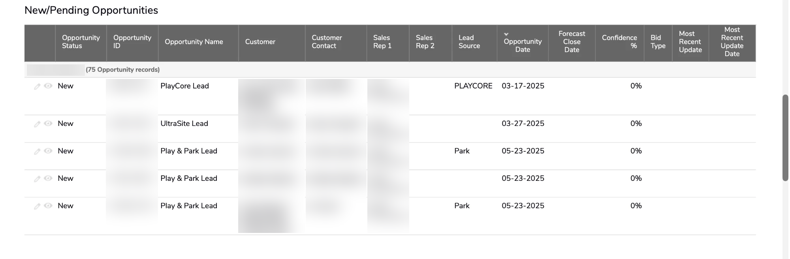
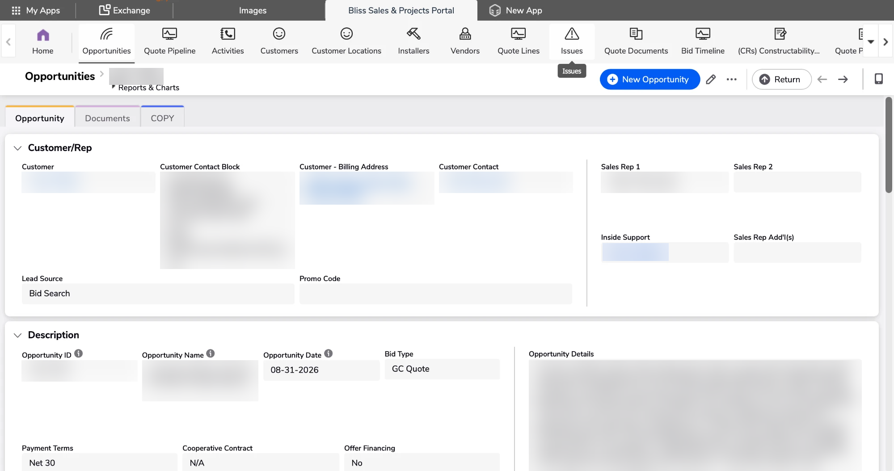
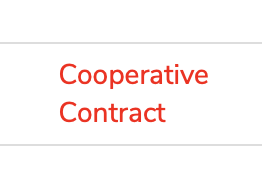
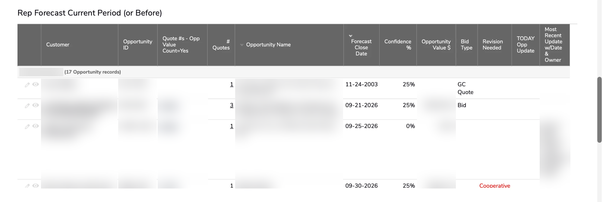
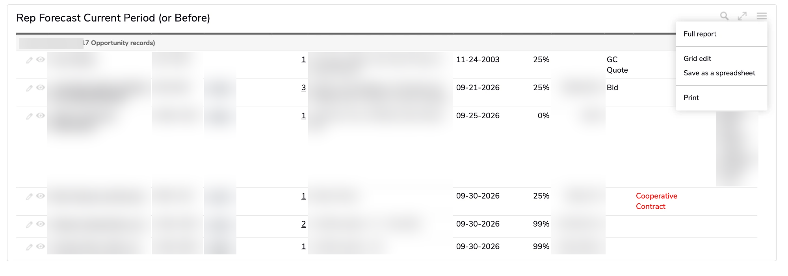
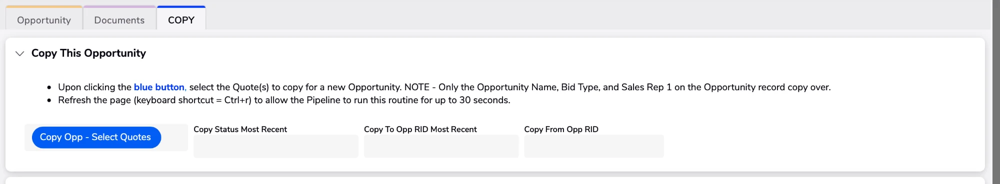
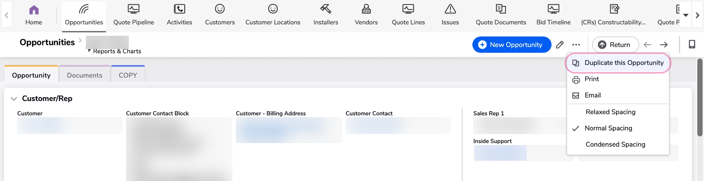
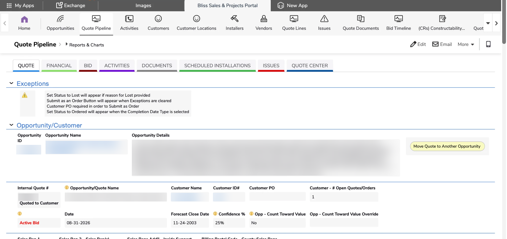
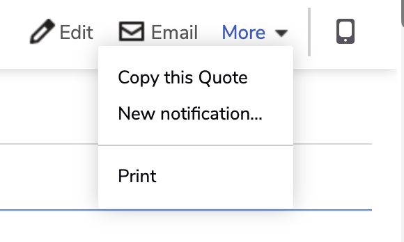
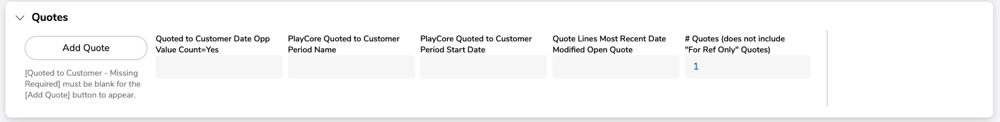

# QuickBase — a quick visual guide

The QuickBase screens you'll use most, in the order you'll usually need them. Customer names, contacts,
reps, IDs and dollar amounts are blurred — your screens will show your own data.

## 1. Your leads — New/Pending Opportunities

Your dashboard home page shows your own new and pending opportunities — your unworked leads. Always start
from **Opportunities**, not Quote Pipeline (that's the older tab).

## 2. An opportunity record

Think of an Opportunity as a file-cabinet folder — one per piece of business, with its quote(s) inside.
Payment Terms, Cooperative Contract and Offer Financing live here. If co-op or financing doesn't apply,
pick "N/A" or "No" — don't leave it blank.

## 3. Red text = Revision Needed

Red text on an opportunity lists exactly what's missing (here, Cooperative Contract). Fill in each field it
names and it clears on its own. Until it does, the quote can't move to Order Submitted.

## 4. Your forecast — Rep Forecast Current Period (or Before)

Where you see and update Forecast Close Date, Confidence and Today Opp Update for each opportunity. The
Revision Needed column shows red text for anything missing.

## 5. Updating many at once — Grid edit

On the forecast report, open the **☰ menu** at the top right and pick **Grid edit** to update a lot of
opportunities at once. The `forecast-update` tool gets your values ready to paste straight in.

## 6. Copying an opportunity — the blue button (COPY tab)

On the opportunity, open the **COPY** tab and click the blue **Copy Opp - Select Quotes** button, then pick
the quote(s) to bring along. Only the Opportunity Name, Bid Type and Sales Rep 1 copy over — fill in the
rest. Refresh the page (Ctrl+R); the copy can take up to 30 seconds to appear.

## 7. Don't copy from the three-dot menu

**Don't use "Duplicate this Opportunity"** in the three-dot (…) menu. It drops most of the fields and makes
a mess. Use the blue button on the COPY tab instead.

## 8. Moving a quote to another opportunity — the yellow button

On the quote, in the Opportunity/Customer section, click the yellow **Move Quote to Another Opportunity**
button. No need to close the quote and start over.

## 9. Copying a quote — the purple button

To copy a quote within the same opportunity (for example, to present options), click the purple **Copy
Quote for this Opportunity** button on the quote.

**Don't use More ▾ → "Copy this Quote"** instead — that's the built-in copy and drops most of the fields.

## 10. Adding a quote

Add a quote from the Quotes section of the opportunity. The **Add Quote** button only appears once
"Quoted to Customer - Missing Required" is blank, so clear any Revision Needed items first.
